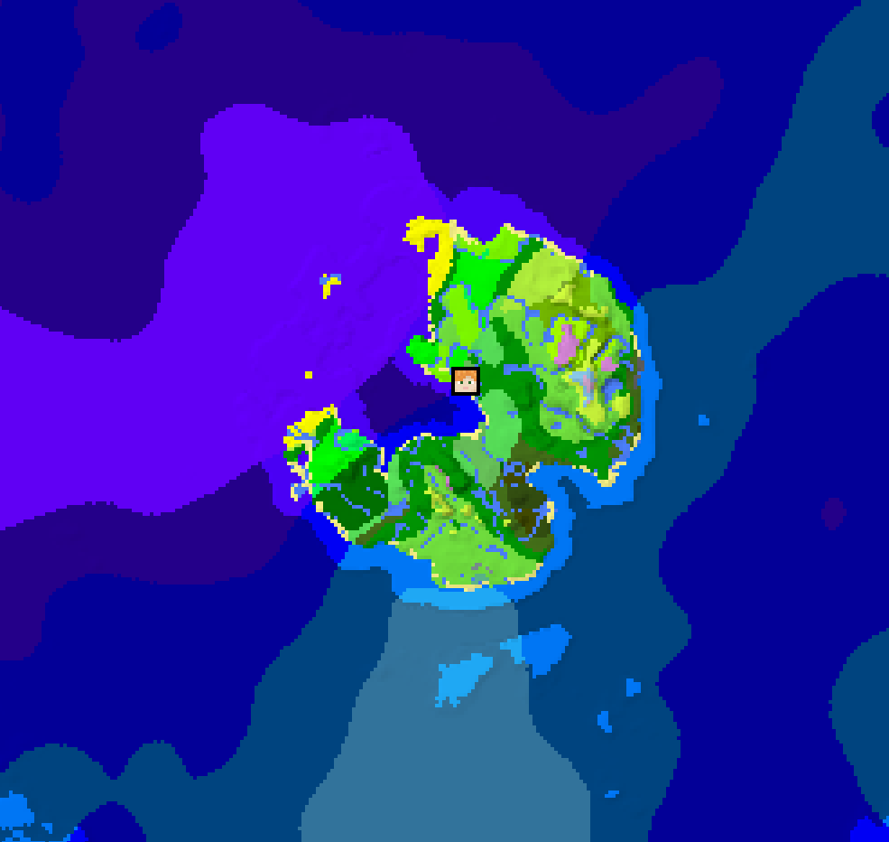
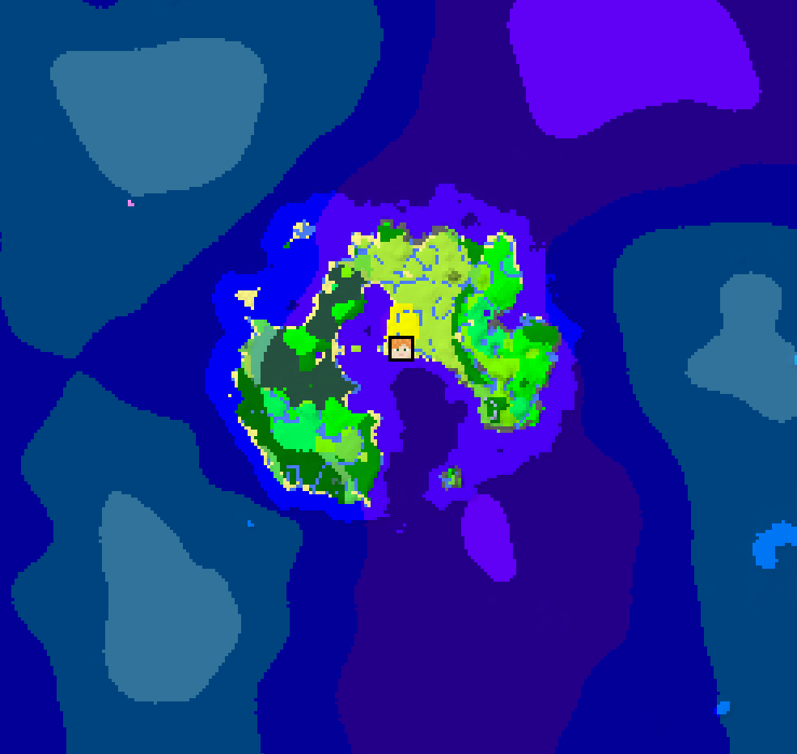
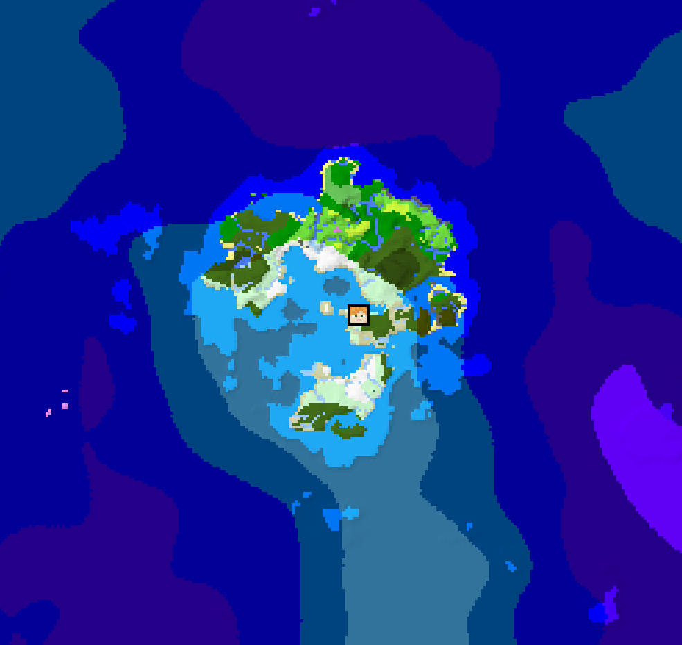
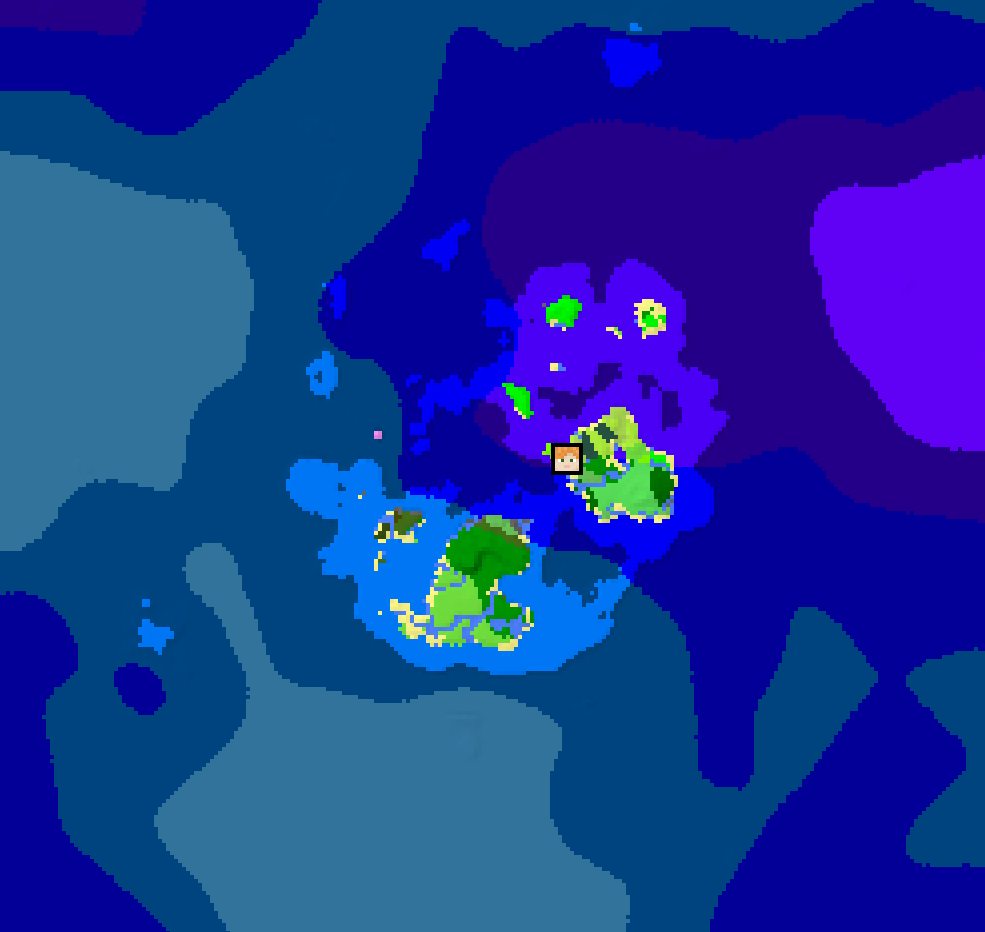

# Oceanus

Oceanus makes your world smaller without the need for an intrusive barrier. This is done by preventing land generation once you've travelled a certain distance, creating a circular world surrounded by endless ocean.

## Configurability

* Unaffected Radius: Radius around spawn where terrain generation is unchanged from vanilla
* Falloff Radius: Width of the band in which land is gradually overtaken by the ocean
* Mushroom islands: Enable or disable mushroom island generation in the endless ocean
* Offset: Offset the center of the unaffected/falloff area
* Ocean Variability: How varied the ocean terrain is, from endless deep ocean to regular ocean generation

---
Also check out [One Survival Island](https://modrinth.com/datapack/one-survival-island) by Klinbee.

Credit to [Uni](https://github.com/unnecessarymb) for the vanilla coordinate density function.

## Examples

|  |  |
|---|---|
|  | 
